### OCI platform Devision 

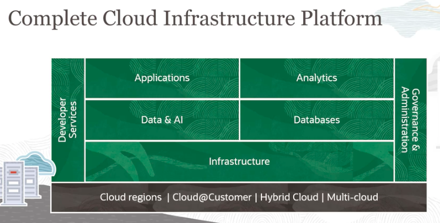

### Regions - availabilty zone 

### fault domains - are logical DC within AV 

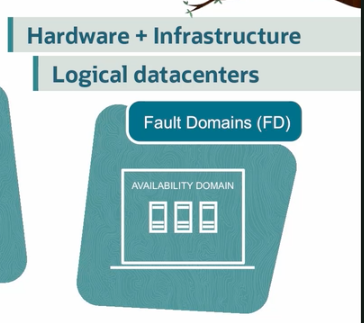

### fault domains have logical DC within the AV 

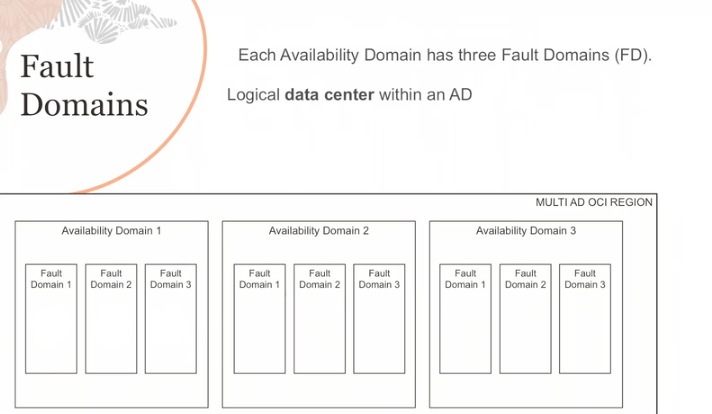

# IAM 

### More info 

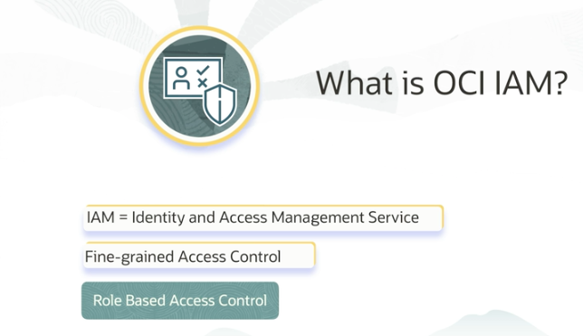

### how anybody can access OCI -- Identity domain - groups - users - RBAC - compartment - resources 

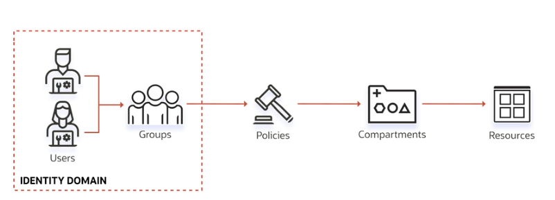

### Every Resources in OCI is having Identity 

### example of Resources 

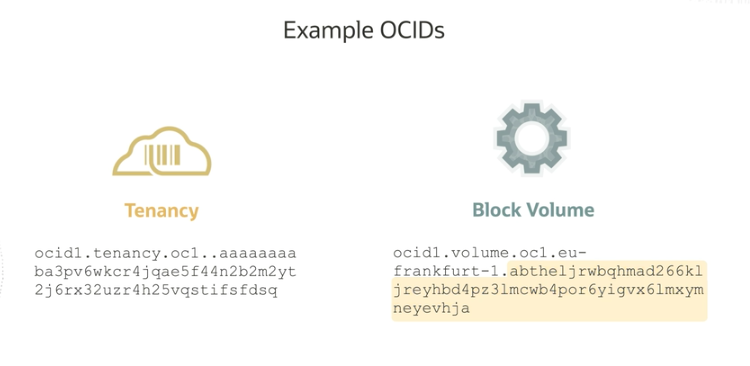

## Compartment 

### root and other compartment 

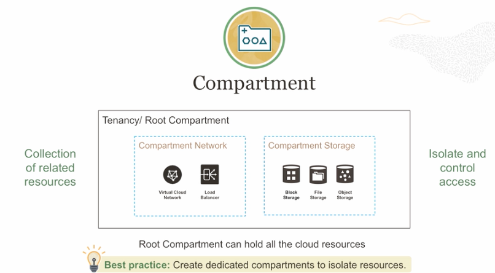

### resources can be moved from one compartment to others 

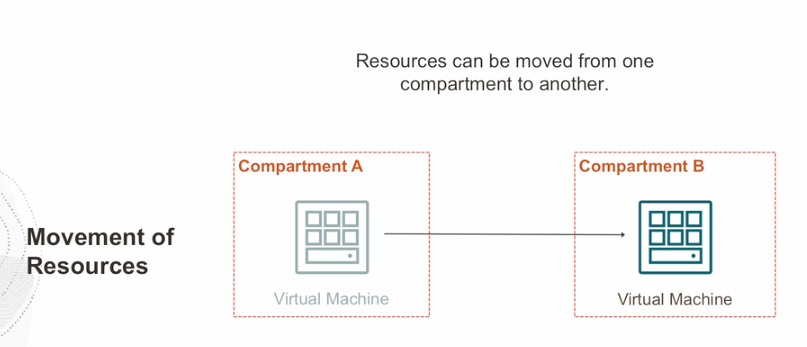

### Resources from Multiple regions can be in same compartment 

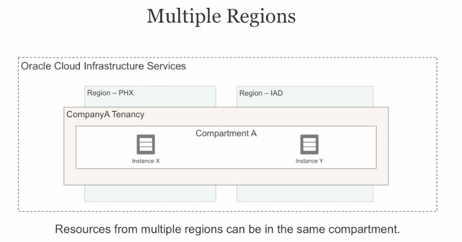

### Note: compartment can be nested at 6 level 

### compartments can have quotas and budget restrictions 

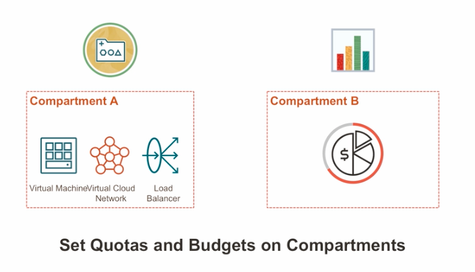

## Tenancy -- is like a new account 

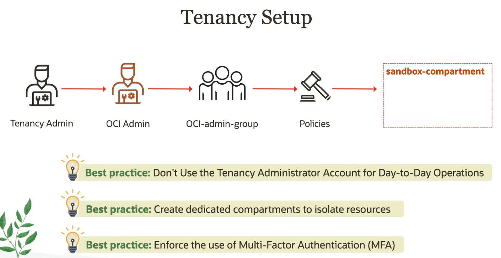

### some policies to OCI-admin 

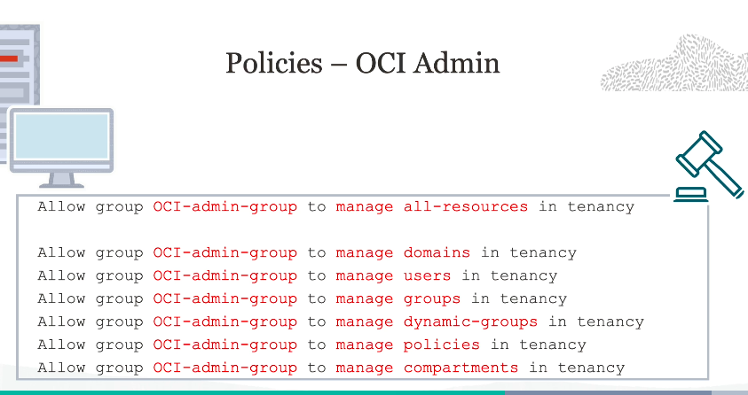

# Networking in cloud 

## OCI -- VCN ---{Virtual Cloud Network}

### Introduction 

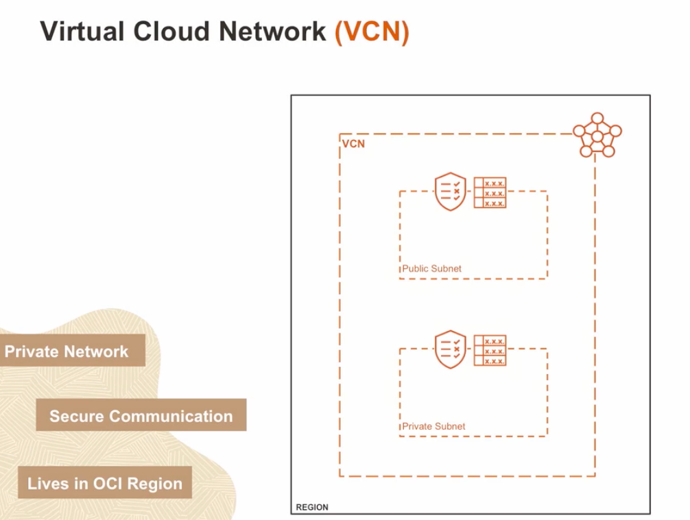

### NAT gateway -- only for outbound traffic 

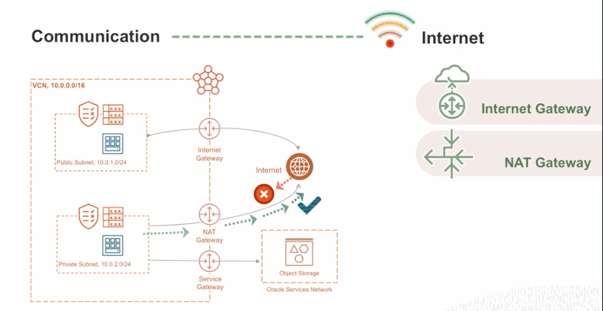

## gateways in VCN 

### NAT gateway

 Only for outbound connection for compute instances 

### Internat gateway 

 If OCI instances ingress and egress connection 

### service gateway

 If OCI Instances want to access OCI public services like OBject storage via secure connection 

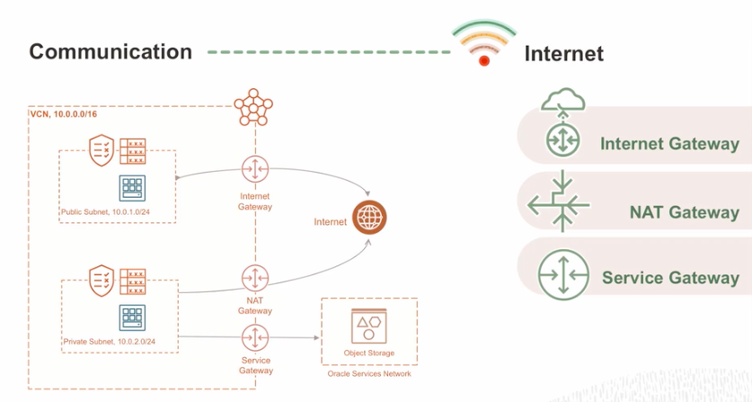

###  dynamic gateway routing 

 use to do routing on non-internet target either cloud of on primise systems 

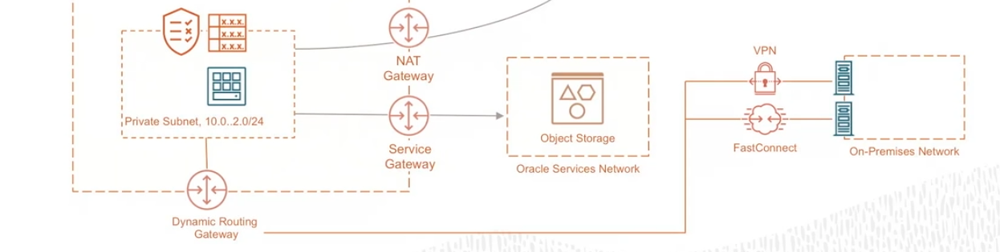

## Routing table --

### for network packet flow control 

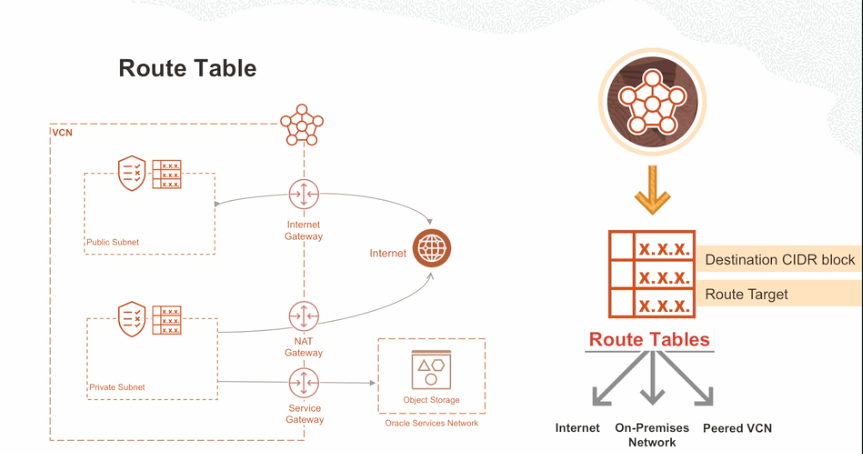

### communication between two VCN 

## Security in VCN 

### security list  :- they are associated with SUbnets 

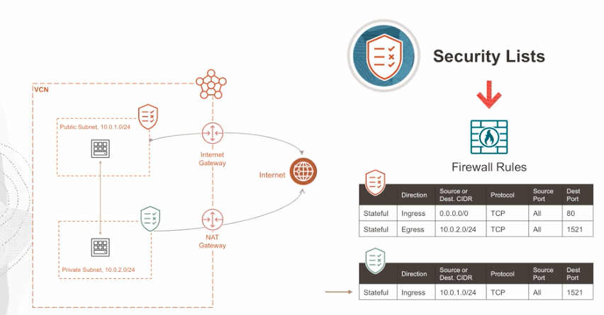

### network security groups :- ONly applies to Virtual NIC 

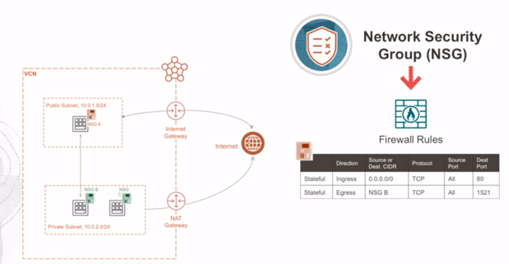

