### OCI platform Devision 

### Regions - availabilty zone 

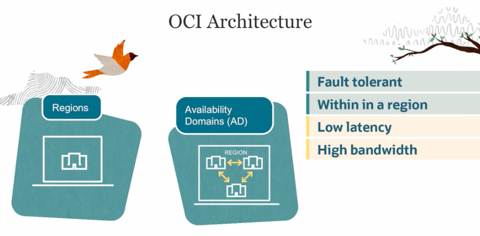

### fault domains - are logical DC within AV 

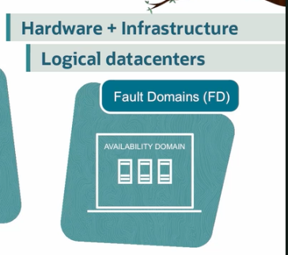

### fault domains have logical DC within the AV 

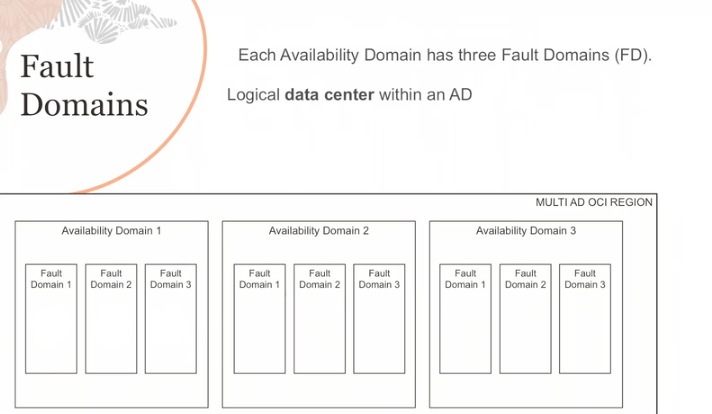

# IAM 

### More info 

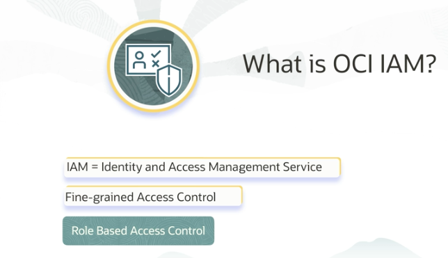

### how anybody can access OCI -- Identity domain - groups - users - RBAC - compartment - resources 

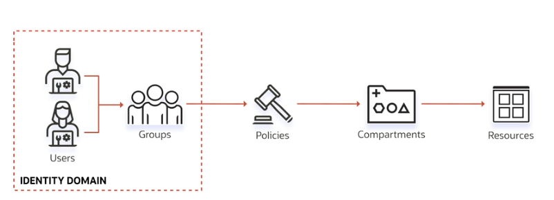

### Every Resources in OCI is having Identity 

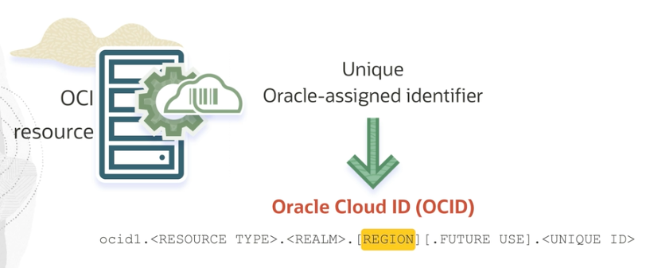

### example of Resources 

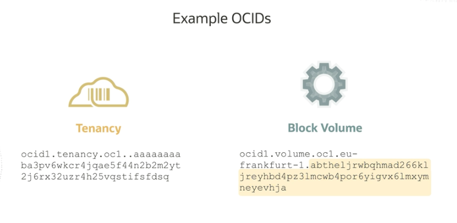

## Compartment 

### root and other compartment 

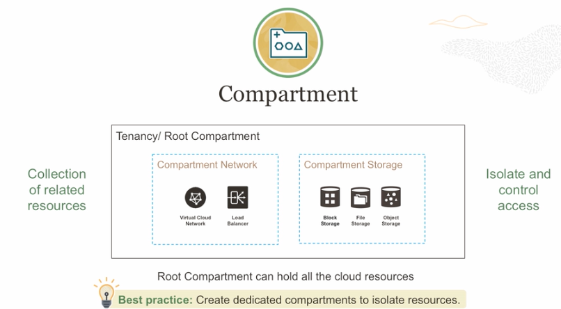

### resources can be moved from one compartment to others 

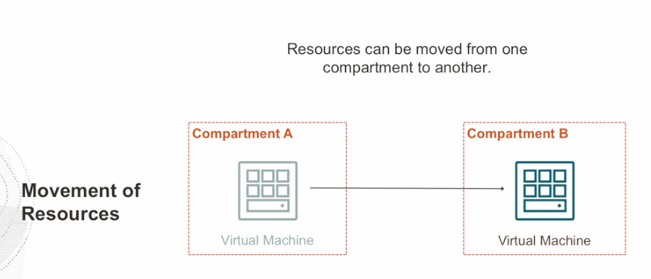

### Resources from Multiple regions can be in same compartment 

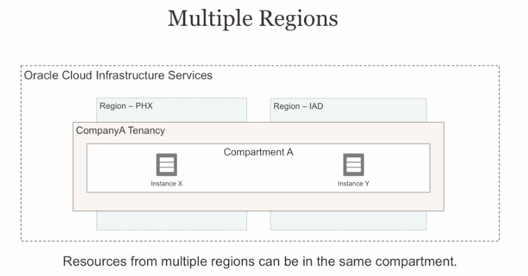

### Note: compartment can be nested at 6 level 

### compartments can have quotas and budget restrictions 

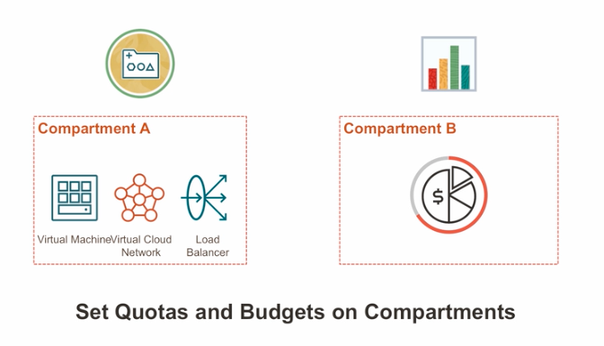

## Tenancy -- is like a new account 

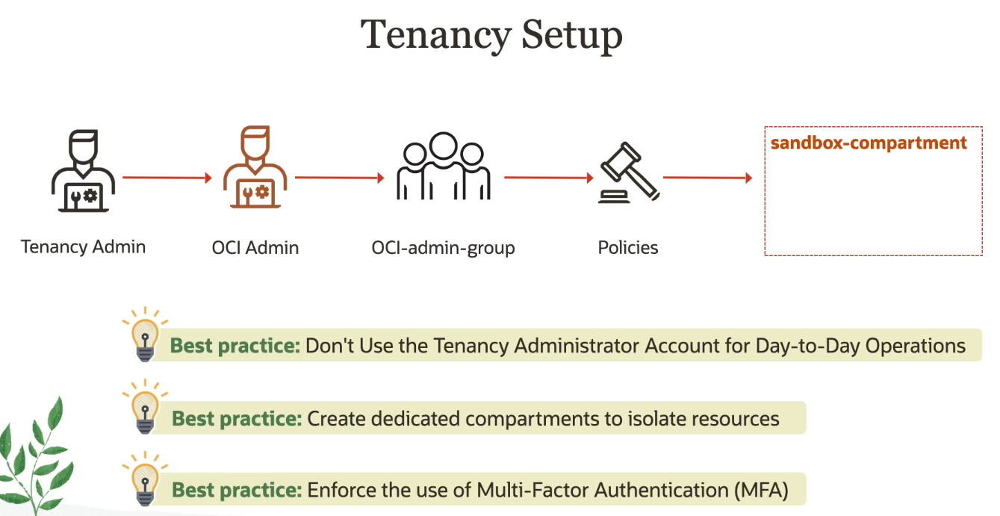

### some policies to OCI-admin 

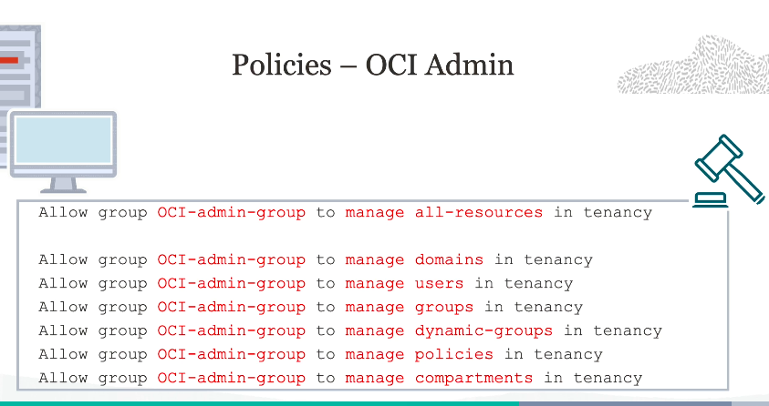

